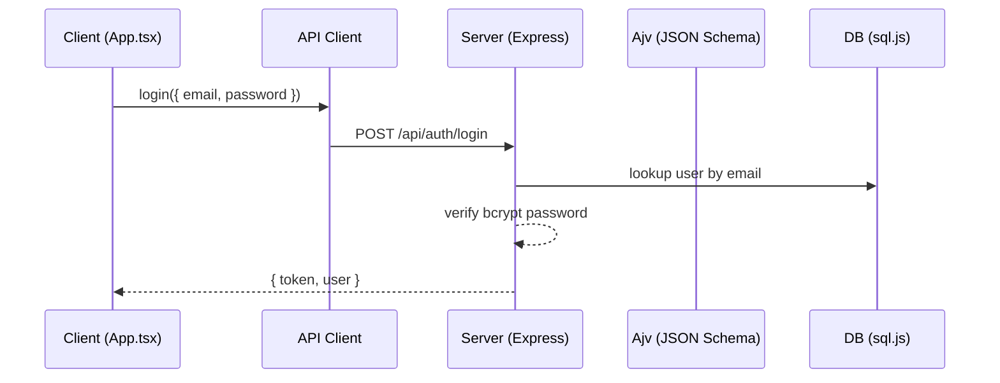

# Basic User Management – Architecture

## Overview
This project implements a simple, full‑stack user management system with a single, language‑agnostic source of truth for the data model. The canonical schema lives in JSON Schema and drives:
- Runtime validation in the backend
- Generated TypeScript types for the frontend and Node code
- An OpenAPI 3.1 specification for future SDK/server generation

## System Diagram
```mermaid
flowchart TD
  subgraph Client [React (Vite, TS)]
    UI[App.tsx] --> APIClient[Typed API Client]
  end

  subgraph Shared [Shared]
    JSONSchema[JSON Schema (User, UserInsert, UserUpdate)]
    Types[Generated TS Types (types.d.ts)]
    OpenAPI[OpenAPI 3.1]
  end

  subgraph Server [Express API]
    Routes[/Routes/]
    Auth[JWT Auth]
    Validation[Ajv Validation]
    DB[sql.js (SQLite file)]
  end

  UI --> APIClient -->|HTTP| Routes
  Routes --> Auth
  Routes --> Validation
  Validation --> DB
  JSONSchema --> Validation
  JSONSchema --> Types
  JSONSchema --> OpenAPI
  APIClient -. consumes .- Types
  UI -. uses .- Types
```

## Data Flow (Login example)


## Components
- Client: React + Vite + TypeScript
  - UI: [App.tsx](file:///Users/kirandimble/Documents/trae_projects/basic_user_management/client/src/App.tsx)
  - Typed API: [api.ts](file:///Users/kirandimble/Documents/trae_projects/basic_user_management/client/src/api.ts)
  - Types imported from shared/types.d.ts
- Server: Node + Express
  - Entry: [server.js](file:///Users/kirandimble/Documents/trae_projects/basic_user_management/server.js)
  - Auth: JWT with role‑based access
  - Validation: Ajv (2020) using JSON Schema
  - DB: SQLite via sql.js wrappers in [sqlite.js](file:///Users/kirandimble/Documents/trae_projects/basic_user_management/db/sqlite.js)
- Shared Model (single source of truth)
  - Schema: [user.schema.json](file:///Users/kirandimble/Documents/trae_projects/basic_user_management/shared/schema/user.schema.json)
  - Schema exports: [user.export.json](file:///Users/kirandimble/Documents/trae_projects/basic_user_management/shared/schema/user.export.json), [userInsert.export.json](file:///Users/kirandimble/Documents/trae_projects/basic_user_management/shared/schema/userInsert.export.json), [userUpdate.export.json](file:///Users/kirandimble/Documents/trae_projects/basic_user_management/shared/schema/userUpdate.export.json)
  - Generated types: [types.d.ts](file:///Users/kirandimble/Documents/trae_projects/basic_user_management/shared/types.d.ts)
  - OpenAPI: [openapi.yaml](file:///Users/kirandimble/Documents/trae_projects/basic_user_management/openapi/openapi.yaml)

## Validation & Types
- Backend: Ajv validates request bodies against JSON Schema ($defs: UserInsert, UserUpdate).
- Frontend: json-schema-to-typescript generates types.d.ts; UI and API client use these types for compile‑time safety.
- Consistency: A change in the schema requires running codegen and automatically syncs types across layers.

## Build & Tooling
- Codegen: `npm run codegen` generates shared/types.d.ts from JSON Schema exports using [generate-types.cjs](file:///Users/kirandimble/Documents/trae_projects/basic_user_management/scripts/generate-types.cjs).
- Pre‑commit: [.githooks/pre-commit](file:///Users/kirandimble/Documents/trae_projects/basic_user_management/.githooks/pre-commit) regenerates types and stages the result.
- CI: [.github/workflows/schema.yml](file:///Users/kirandimble/Documents/trae_projects/basic_user_management/.github/workflows/schema.yml) runs `npm run check:types` to ensure types are up‑to‑date.

## Configuration
- Backend:
  - JWT_SECRET: secret for signing tokens
  - DATABASE_FILE: override SQLite file path (defaults to db.sqlite3)
- Frontend:
  - VITE_API_BASE: API base URL (defaults to http://localhost:3000)

## Run
- API: `npm start` at project root → http://localhost:3000
- Client: `cd client && npm run dev` → http://127.0.0.1:5173
- First registration becomes admin

## Evolution
- Persisted DB: Swap sql.js for Postgres/MySQL. Keep JSON Schema as domain contract and add migrations.
- SDKs: Generate clients/server stubs from OpenAPI 3.1 in any language (Python, Java, Go).
- Additional resources: Extend schemas and add new paths in OpenAPI as features grow.

